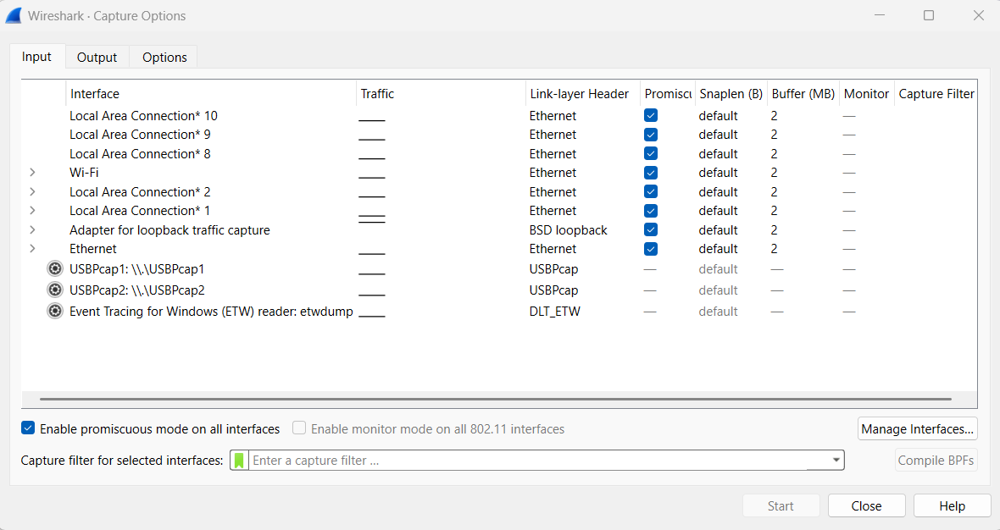
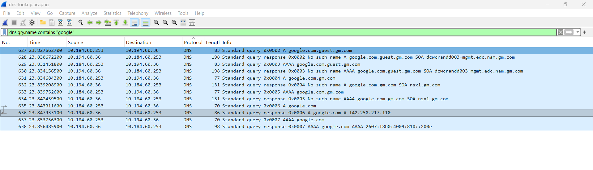
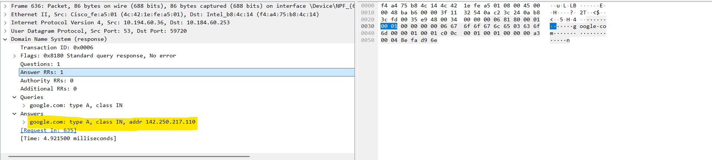
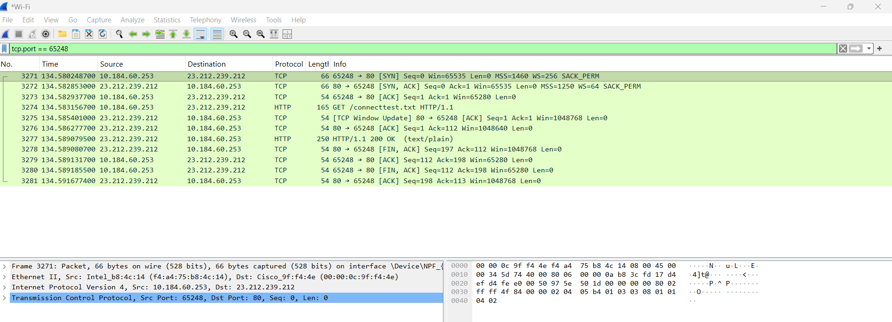
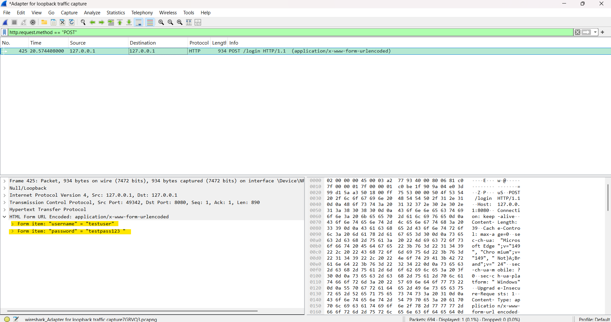
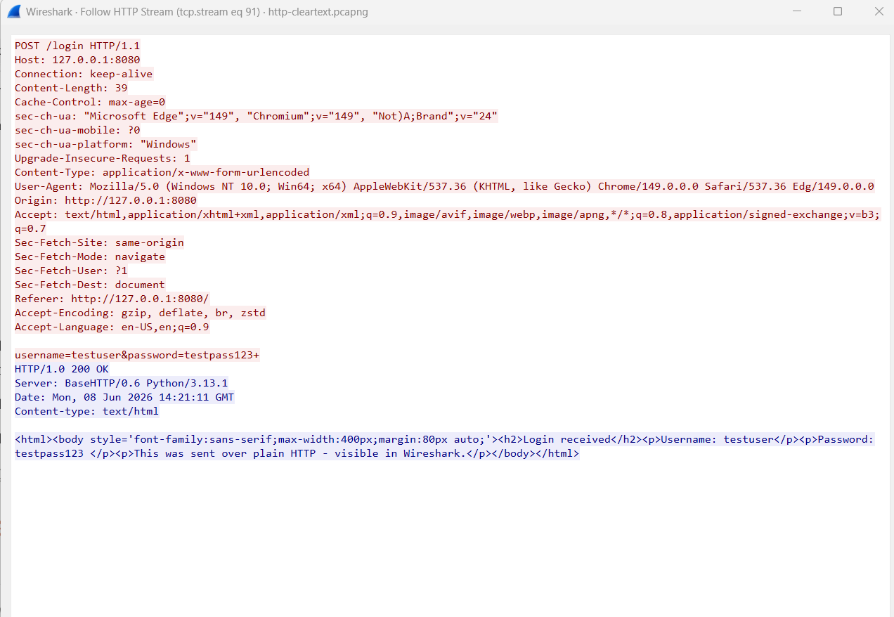

# Wireshark Network Traffic Analysis Lab

**Tool:** Wireshark 4.6.6 (Npcap 1.88)
**Author:** Hazekiah Kennedy
**Skills:** Packet Analysis · Network Protocols · TCP/IP · DNS · HTTP · Network Security
**Certification alignment:** CompTIA Network+ · Security+ · CySA+

---

## What This Lab Does

Captures and analyzes live network traffic to understand how core internet protocols actually work on the wire — and why unencrypted protocols are a security risk. Four hands-on exercises walk through a DNS lookup, a TCP three-way handshake, capturing cleartext credentials over HTTP, and reassembling a full conversation with Follow TCP Stream.

---

## Capture Environment

All four exercises were captured live using Wireshark's interface list — Wi-Fi for external traffic (Exercises A, B) and the loopback adapter for the local HTTP server (Exercise C).



---

## Exercises

### A — DNS Lookup
Captured a DNS query and response for `google.com` (triggered with `nslookup`). Located the A-record query (`Standard query A google.com`) and its response carrying Google's IP address (142.250.21.x). DNS is the internet's address book — this shows the name-to-IP resolution that happens before almost every connection.

Network note: the capture also showed the local DNS search suffix in action — the resolver first tried `google.com.guest.gm.com` and similar internal domains (returning "No such name") before the clean public lookup succeeded. That's normal corporate-network behavior worth recognizing.

**Capture:** `captures/dns-lookup.pcapng`




---

### B — TCP Three-Way Handshake
Captured the full TCP connection setup to a web server. The three-packet handshake is clearly visible:

| Packet | Flag | Meaning |
|---|---|---|
| 1 | **SYN** | Client → server: "I want to connect" (proposes sequence number) |
| 2 | **SYN, ACK** | Server → client: "Acknowledged, here's mine" |
| 3 | **ACK** | Client → server: "Confirmed — connection established" |

The capture continues into the full HTTP session (`GET /connecttest.txt`, `HTTP/1.1 200 OK`) and the FIN packets that cleanly close the connection — a complete TCP session start to finish.

**Capture:** `captures/tcp-handshake.pcapng`



---

### C — Capturing Cleartext Credentials over HTTP
Demonstrates why HTTP (without TLS) is dangerous. A local test login form was served over plain HTTP, and a login was submitted with test credentials (`testuser` / `testpass123`). Filtering for `http.request.method == "POST"` and expanding the **HTML Form URL Encoded** section reveals the username and password sitting in **plaintext** — fully readable to anyone capturing the traffic.

In the screenshot below, the cleartext username and password are highlighted to make the point obvious: over HTTP, credentials travel in the clear. The exact same submission over **HTTPS** would appear as unreadable encrypted ciphertext. This is the core argument for TLS everywhere.

> Note: This was performed against a local test server (`127.0.0.1`) that I control. Capturing credentials on networks or systems you do not own is illegal — the lab is built around a self-hosted form specifically to stay on the right side of that line.

**Capture:** `captures/http-cleartext.pcapng`



---

### D — Follow TCP Stream
Right-clicking a packet and choosing **Follow → TCP Stream** reassembles the entire conversation into one readable transcript instead of isolated packets. This is how an analyst reconstructs what actually happened in a session — invaluable for incident response and data-exfiltration investigations.

**Reading the colors:**
- **Red text** = traffic from client to server (the request leaving the browser — here, the POST carrying the cleartext credentials)
- **Blue text** = traffic from server to client (the server's response — the HTML page sent back)

The color split lets you instantly separate "what was sent" from "what was answered" when reading a reconstructed session.



---

## Key Takeaways

- **DNS** resolves names to IPs before connections happen, and local search suffixes can add extra lookups worth recognizing on the wire.
- **TCP** establishes reliable connections through the SYN / SYN-ACK / ACK handshake before any application data flows.
- **HTTP sends everything in plaintext** — including credentials — which is directly observable in a capture. This is the practical, on-the-wire justification for HTTPS/TLS.
- **Follow TCP Stream** reconstructs full sessions from individual packets, with color separating client and server traffic — a foundational skill for network forensics and incident response.

---

## Files

```
wireshark-network-analysis/
├── captures/
│   ├── dns-lookup.pcapng
│   ├── tcp-handshake.pcapng
│   └── http-cleartext.pcapng
├── screenshots/
│   ├── 01-wireshark-interfaces.png
│   ├── 02-dns-query-response.png
│   ├── 03-dns-answer.png
│   ├── 04-tcp-handshake.png
│   ├── 05-http-cleartext.png
│   └── 06-follow-tcp-stream.png
└── README.md
```

Open any `.pcapng` file in Wireshark to inspect the captured packets directly.
